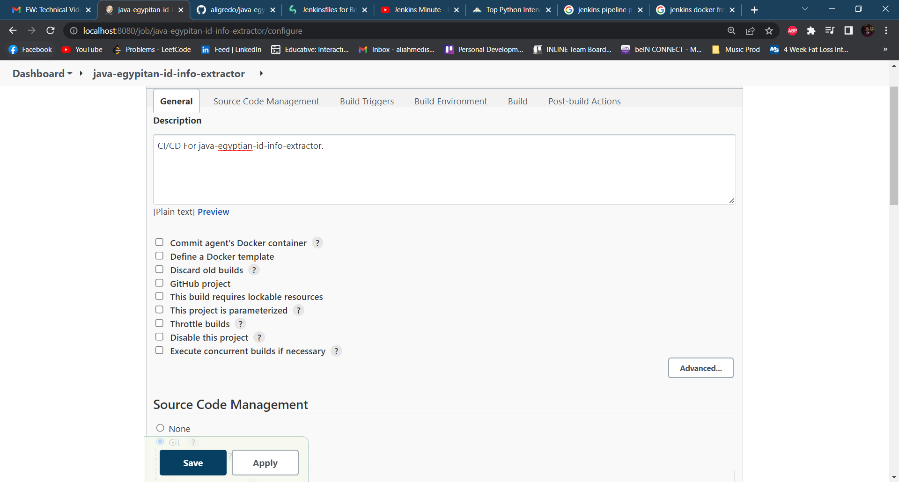
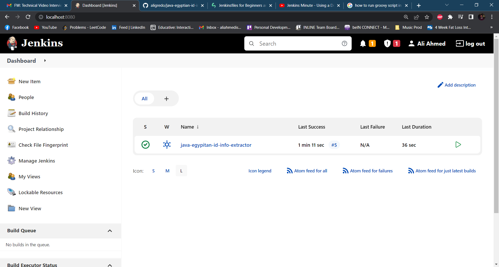

## 1. Install Groovy On Jenkins

----
## 2. Install Groovy Plugin On Jenkins

----
## 3. Install Docker Plugins On Jenkins

----
## 4. Creating A New Free Style Job On Jenkins

### Setting Git Server As Github And Providing Github Repo SSH Link

### Setting The Build Trigger As The Hook To Recive Push Events On The Webhook That Will Be Setup On Github

### Build By Executing Groovy Script To Build And Run Docker Container

### Post Build Action To Show Commit Status Build On Github Repo

----
## 5. Exposing Jenkins Localhost URL USing Ngrok Proxy Server

----
## 6. Setting The Webhook On The Github Repo Settings

----
## 7. Results
### Push Event:

### Triggered Successful Build

### Github Commit Build Status
